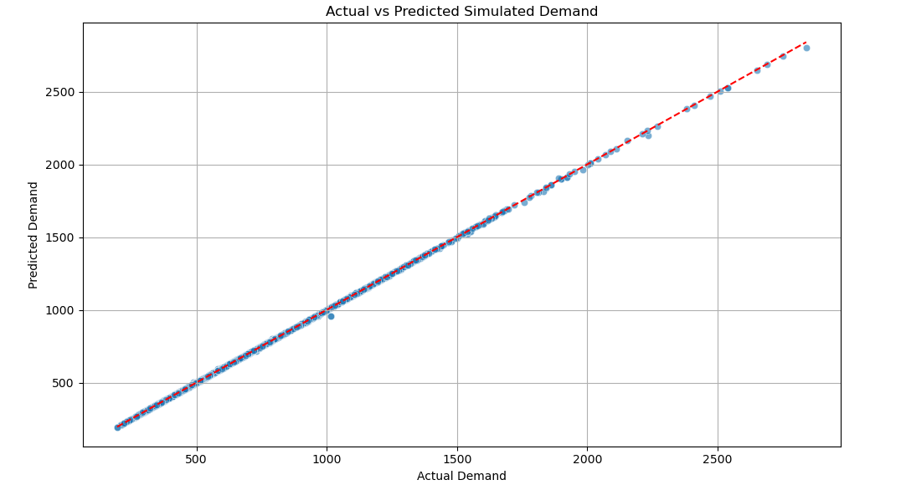
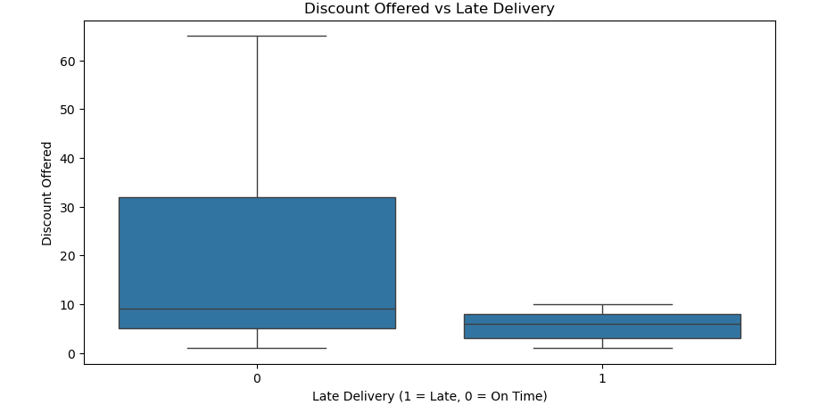
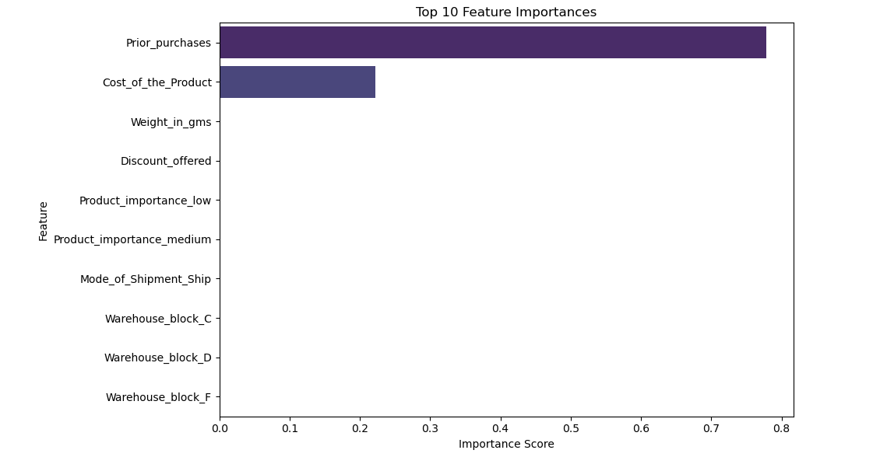
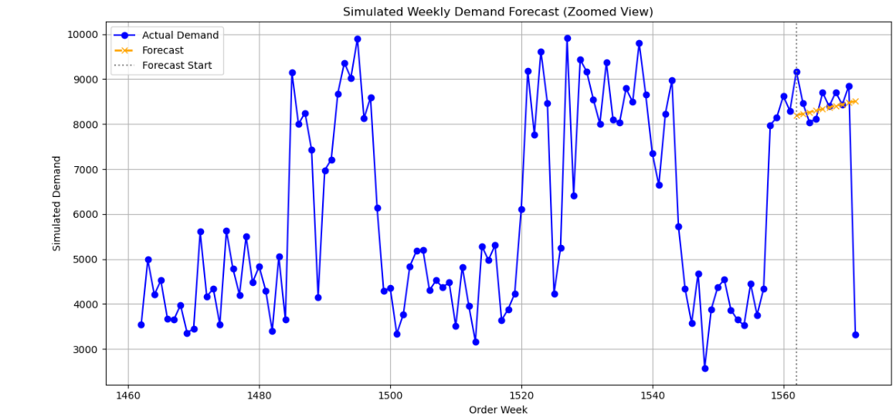

# 📦 Supply Chain Demand Forecasting & Root Cause Analysis

This project applies supervised machine learning to forecast product demand in a supply chain environment. It also conducts root cause analysis to identify factors contributing to delivery delays and presents key KPIs through interactive dashboards.

---

## 📁 Dataset

- **Source**: [Kaggle Supply Chain Dataset](https://www.kaggle.com/datasets/prachi13/customer-analytics)
- **Size**: ~10,000 records
- **Features**:
  - Warehouse block, shipment mode, cost, prior purchases, discount, product importance, weight
- **Target**: `Simulated_Demand = Cost_of_the_Product × Prior_purchases`

---

## 🎯 Project Goals

- Forecast weekly demand with high accuracy using ML models
- Identify key drivers of late deliveries through root cause analysis
- Visualize KPIs, forecasts, and insights using Power BI / Tableau dashboards

---

## 🧠 Model Summary

- **Algorithm**: Random Forest Regressor
- **Evaluation Metrics**:
  - MAE: `0.44`
  - RMSE: `2.58`
  - R² Score: `0.99995`

---

## 📊 Root Cause Analysis

Analyzed late deliveries by:
- **Warehouse**: A and C showed highest late shipment rates
- **Mode of Shipment**: Road showed most delays
- **Product Importance**: High-priority items were delayed less often

---

## 🔍 Feature Importance

The model highlighted key predictors of demand:

---

## 📈 Forecasting Results

Forecasted demand closely matched actual weekly demand for the final 10 test weeks.

---

## 📊 Dashboard (Power BI)

The interactive dashboard includes:
- KPIs: MAE, RMSE, R²
- Forecast trends
- Delay analysis by warehouse, shipment mode, and product importance
- Feature-driven insights

---

## 🛠️ Tech Stack

- **Language**: Python
- **Libraries**: scikit-learn, pandas, seaborn, matplotlib
- **ML Model**: Random Forest Regressor
- **Dashboard Tools**: Power BI, Tableau Public
- **Notebook**: Jupyter

---

## 📂 File Structure

| File | Description |
|------|-------------|
| `Train.csv` | Raw dataset |
| `forecast_model.ipynb` | Complete ML pipeline |
| `Forecasted_SupplyChain_Data.csv` | Final dataset with predictions |
| `README.md` | Project documentation |
| `*.png` files | Visualizations (root directory) |

---

## 📌 Business Impact

- Enabled **accurate, proactive inventory planning** using near-perfect demand forecasting (R² = 0.99995)
- Supported **root cause analysis** for delayed shipments by analyzing discount, mode, and warehouse patterns
- Provided a ready-to-use dashboard for **data-driven decision making**
- Model performance aligns with **Six Sigma standards**, reducing demand forecast error below critical defect thresholds

---

## 📬 Contact

Feel free to reach out via [LinkedIn](https://www.linkedin.com/in/your-profile) or email for collaboration or questions.
